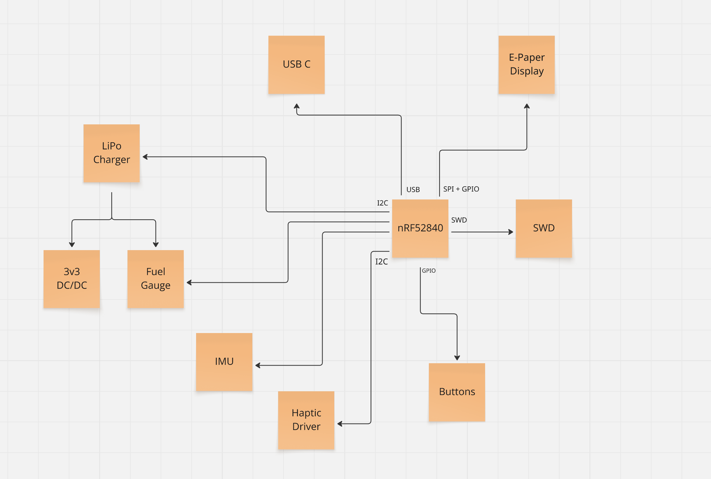

# InkTime v6

InkTime v6 este o platformă wearable construită pentru autonomie mare și interacțiune discretă. Dispozitivul folosește un display e-paper, conectivitate Bluetooth Low Energy, senzori de mișcare, feedback haptic și alimentare dintr-un acumulator LiPo încărcat prin USB-C.

La nivel de arhitectură, tot sistemul este orchestrat de un **Nordic nRF52840**, care gestionează radio-ul, magistralele digitale și logica de power management.

---

## Ce face dispozitivul

InkTime v6 este gândit ca un smartwatch sau dispozitiv portabil cu consum redus, capabil să rămână activ perioade lungi de timp între încărcări.

Funcțiile principale sunt:

- afișare pe e-paper, cu consum aproape nul în stare statică;
- comunicație BLE;
- detecție de mișcare și numărare pași;
- feedback haptic;
- încărcare prin USB-C;
- monitorizare a stării bateriei.

---

## Diagramă bloc

---

## Nucleul sistemului

### nRF52840

Controlerul principal este **nRF52840**, un SoC cu ARM Cortex-M4F, memorie Flash de 1 MB, 256 KB RAM, radio 2.4 GHz multiprotocol și interfață USB 2.0 Full-Speed integrată.

Acesta a fost ales pentru că permite integrarea într-un singur cip a mai multor funcții importante:

- comunicație BLE 5.0;
- control al perifericelor pe I2C și SPI;
- suport USB nativ;
- moduri eficiente de consum redus.

Pentru tactare sunt folosite două cristale externe:

- `X1` — 32 MHz, pentru **HFCLK**;
- `X2` — 32.768 kHz, pentru **LFCLK**.

---

## Interfețe și periferice

### Display e-paper

Interfața principală a utilizatorului este un display e-paper conectat printr-un FPC cu 24 de pini (`J3`). Pentru că afișajul este bistabil, energia este consumată în principal în timpul actualizării, nu în perioada în care imaginea rămâne neschimbată.

Controlul acestui bloc este împărțit în trei părți.

#### 1. Semnale digitale

Comunicarea cu displayul se face printr-o interfață SPI și linii auxiliare:

- `MOSI`
- `SCK`
- `EPD_CS`
- `EPD_DC`
- `EPD_RST`
- `EPD_BUSY`

#### 2. Tensiuni bias pentru panou

Driverul displayului are nevoie de mai multe tensiuni specifice pentru matricea TFT. Acestea sunt obținute cu ajutorul unui mic boost converter și al unei rețele de diode Schottky și condensatoare.

Tensiunile generate sunt:

- `VGH`
- `VGL`
- `VSH`
- `VSL`

#### 3. Oprirea completă a alimentării displayului

Alimentarea de 3.3 V a ansamblului EPD poate fi întreruptă complet printr-un load switch realizat cu MOSFET-ul P-channel **DMG2305UX** (`Q1`). Acesta este comandat de semnalul `EPD_PWR`.

### Accelerometru

Pentru detectarea activității este folosit **BMA423** (`IC2`), un accelerometru digital pe 3 axe.

Rolurile sale în proiect sunt:

- detecția de mișcare;
- step counting;
- generarea de evenimente prin întreruperi.

Componenta este utilizată în **mod I2C**, iar pinul `CSB` este conectat la `VDDIO` pentru a forța această configurație. Cele două ieșiri de întrerupere, `INT1` și `INT2`, sunt rutate separat spre microcontroller.

### Haptic

Blocul de feedback haptic se bazează pe **DRV2605** (`IC1`), controlat pe I2C. Activarea sau dezactivarea lui se face din semnalul `HAPTIC_EN`, conectat la un GPIO al MCU-ului.

Ieșirile `OUT+` și `OUT−` merg direct spre actuatorul haptic.

### Butoane

Sunt implementate trei butoane fizice:

- `SW_UP`
- `SW_DN`
- `SW_ENT`

Fiecare este conectat la câte un GPIO și are:

- pull-up extern de 10 kΩ;
- circuit RC de debounce cu 1 µF la GND.

---

## Alimentare

### USB-C

Conectorul `J1` este un **USB Type-C** (`KH-TYPE-C-16P`) folosit pentru alimentare și pentru conexiunea USB 2.0. În layout sunt rutate doar liniile necesare proiectului.

### Protecție ESD

Pentru protejarea liniilor USB și CC este folosit **USBLC6-2SC6Y**, plasat aproape de conector.

### Încărcător Li-Po

Gestionarea încărcării acumulatorului este făcută de **BQ25180** (`IC4`).

Acest circuit oferă:

- configurare prin I2C;
- curent de încărcare programabil;
- semnalizare de evenimente prin pinul `PMIC_INT`;
- protecție termică.

### Fuel gauge

Monitorizarea bateriei este realizată de **MAX17048** (`U1`), care măsoară tensiunea celulei și estimează nivelul de încărcare.

În design:

- comunică pe magistrala I2C comună;
- folosește semnalul `ALERT` pentru notificări către MCU.

### Convertor DC/DC

Subsistemul de putere include și **RT6160AWSC** (`IC3`), folosit ca convertor DC/DC.

---

## Programare și debug

Pentru flash și depanare este prevăzut un conector **Tag-Connect TC2030-IDC** (`J2`), cu 6 pini, fără header montat permanent pe PCB.

Liniile expuse sunt:

- `VTREF (3.3V)`
- `SWDIO`
- `SWDCLK`
- `SWO`
- `nRESET`
- `GND`

Pe placă există și test pads dedicate:

- `TP_SWDIO`
- `TP_SWDCLK`
- `TP_SWO`
- `TP_RESET`
- `TP_3.3V`
- `TP_GND`

---

## Alocarea pinilor MCU

Mai jos este rezumat mapping-ul relevant pentru nRF52840.

| Pin nRF52840 | Rol | Tip | Observație |
|---|---|---|---|
| **P0.00** | Cristal 32.768 kHz | OSC | Pin dedicat LFXO |
| **P0.01** | Cristal 32.768 kHz | OSC | Pin dedicat LFXO |
| **P0.09** | neconectat | GPIO | rezervat |
| **P0.10** | neconectat | GPIO | rezervat |
| **P0.13** | `MOSI` spre EPD | SPIM | rutare scurtă spre zona displayului |
| **P0.14** | `SCK` spre EPD | SPIM | grupat cu `MOSI` |
| **P0.18** | reset extern | nRESET | pin dedicat |
| **P0.19** | `EPD_CS` | SPIM | asociat interfeței EPD |
| **P0.20** | `EPD_DC` | GPIO | control display |
| **P0.21** | `EPD_RST` | GPIO | reset display |
| **P0.22** | `SWO` | SWO | debug |
| **P0.23** | `EPD_BUSY` | GPIO input + INT | semnal status display |
| **P0.24** | `EPD_PWR` | GPIO | comandă load switch |
| **P0.25** | `HAPTIC_EN` | GPIO | enable pentru DRV2605 |
| **P0.26** | `SDA` | TWIM | magistrală I2C |
| **P0.27** | `SCL` | TWIM | magistrală I2C |
| **P0.28** | neconectat | analog | rezervat |
| **P0.29** | neconectat | GPIO | rezervat |
| **P0.30** | neconectat | GPIO | rezervat |
| **P0.31** | neconectat | GPIO | rezervat |
| **P1.00** | `PMIC_INT` | GPIO input + INT | evenimente de charging |
| **P1.01** | `SW_UP` | GPIO input | buton |
| **P1.02** | `SW_DN` | GPIO input | buton |
| **P1.03** | `SW_ENT` | GPIO input | buton |
| **P1.04** | `IMU_INT1` | GPIO input + INT | eveniment accelerometru |
| **P1.05** | `IMU_INT2` | GPIO input + INT | eveniment accelerometru |
| **P1.06** | `ALERT` | GPIO input + INT | alertă baterie |
| **P1.07** | EPD spre Q3 | GPIO / PWM | comandă auxiliară |
| **SWDCLK** | programare / debug | dedicat | SWD |
| **SWDIO** | programare / debug | dedicat | SWD |
| **VBUS** | detectare USB | USB PHY | sensing VBUS |
| **D+ / D−** | USB 2.0 FS | USB PHY | interfață USB |

---

## Consum și autonomie

### Curent estimat în standby

| Componentă | Curent tipic | Observații |
|---|---:|---|
| nRF52840 (System ON, RAM retention, RTC, LFXO) | ~1.5 µA | radio inactiv |
| BMA423 (low-power, 25 Hz) | ~4 µA | step detection activ |
| BQ25180 (quiescent, no charge) | ~6 µA | |
| MAX17048 (active measurement) | ~23 µA | hibernate ~3 µA |
| DRV2605 (EN=LOW) | < 1 µA | shutdown |
| RT6160 (PFM, fără sarcină) | ~25 µA | ultra-low-quiescent |
| E-paper | ~0 µA | fără refresh |
| Leakage PCB + diode | ~5 µA | estimat |
| **Total** | **≈ 65 µA** | |

### Autonomie estimată pentru 150 mAh

Presupunând un profil de utilizare tipic:

- 23 h 45 min standby la 65 µA → aproximativ 1.54 mAh/zi;
- refresh-uri de ecran → aproximativ 0.2 mAh/zi;
- evenimente haptice → aproximativ 0.01 mAh/zi.

Consum total zilnic estimat:

**≈ 1.75 mAh/zi**

Autonomie rezultată:

**150 mAh / 1.75 mAh pe zi ≈ 85 zile**

---

## Note de implementare

În faza curentă de proiect au fost acceptate câteva compromisuri și excepții:

- pentru rezistoare și condensatoare mici au fost păstrate modele 3D placeholder;
- au fost aprobate 6 erori legate de modelele 3D ale butoanelor;
- au fost acceptate erori de tip **Overlap** și **Copper clearance** asociate utilizării tehnicii **via-in-pad**.

---

## Concluzie tehnică

InkTime v6 este un sistem compact orientat spre consum redus, în care displayul bistabil, BLE-ul, senzorii și managementul de putere sunt integrate în jurul nRF52840. Arhitectura a fost gândită pentru un dispozitiv portabil capabil să ofere autonomie mare, funcții utile de interacțiune și o interfață modernă cu utilizatorul.
